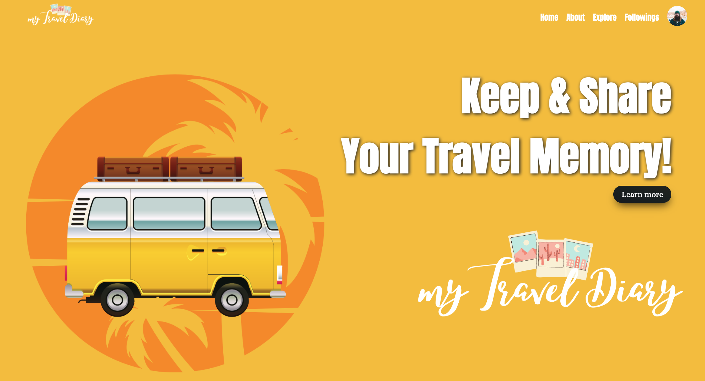
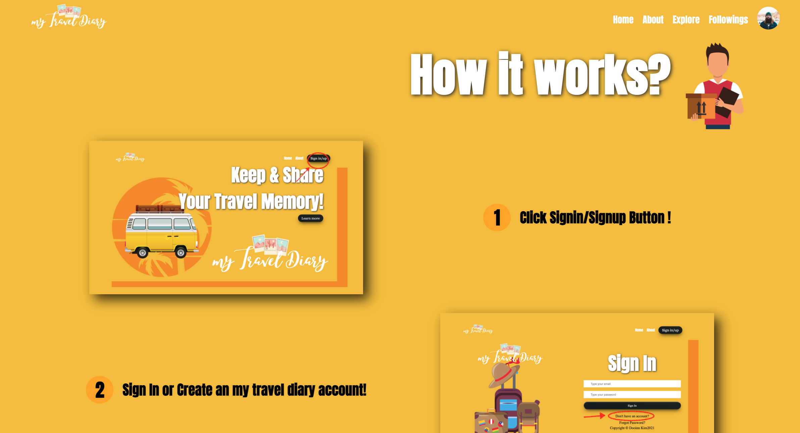
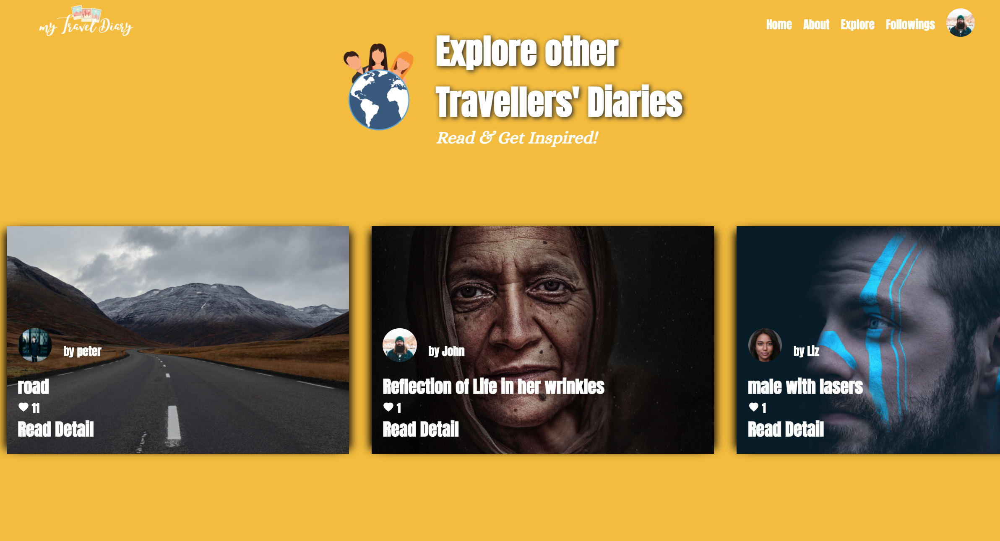
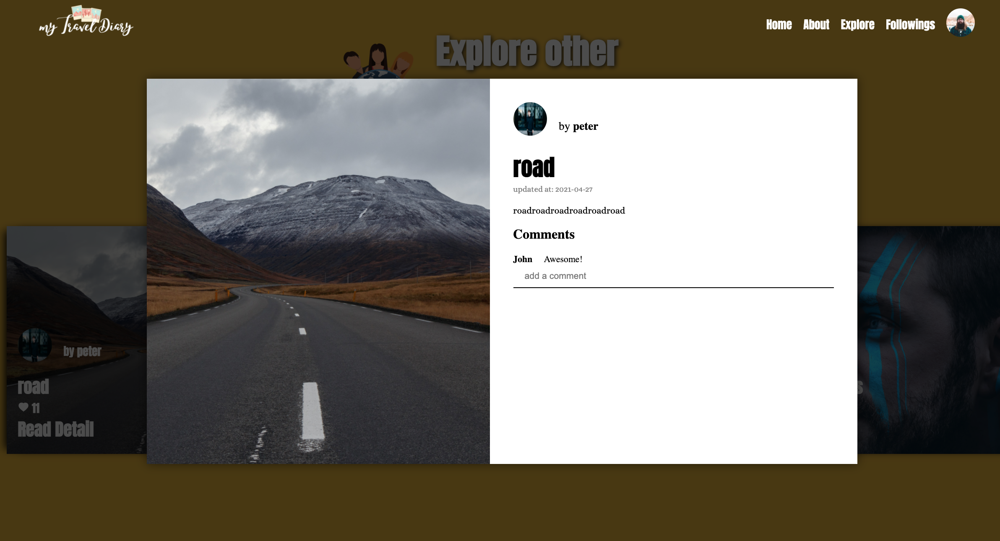
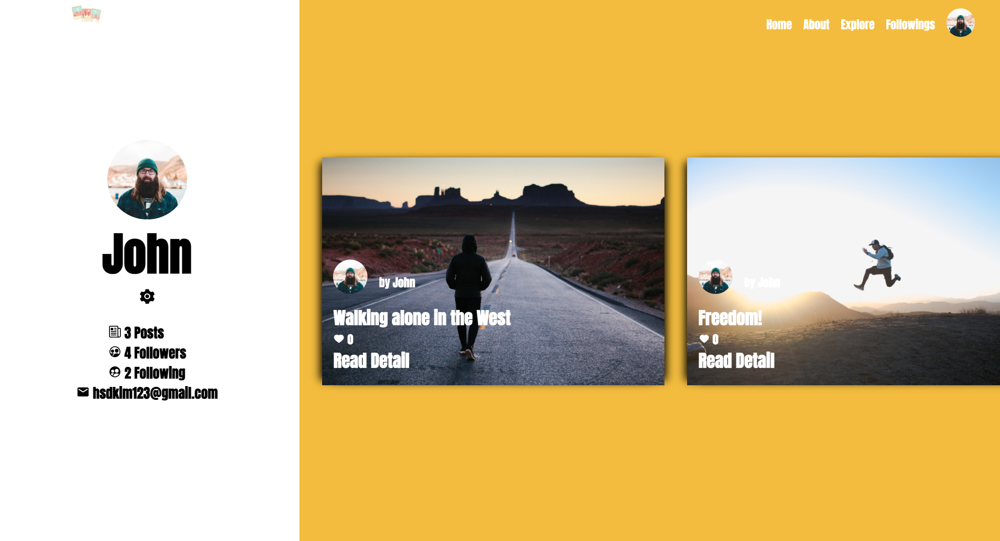
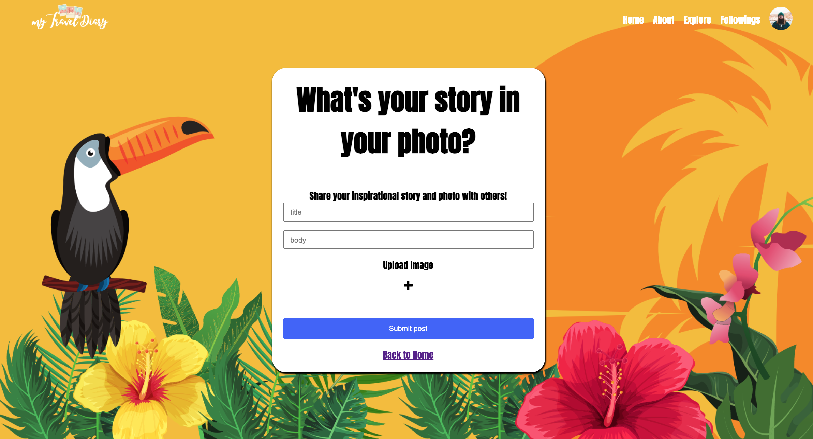

# My Travel Stroy 
"My Travel Story" is a Social Networking website created with
MERN (MongoDB, Express, React, Node JS) stack.



## Table fo Contents
1 [General info](#general-info)
2. [Tehcnologies](#technologies)
3. [Setup](#setup)
4. [Features](#feautres)
5. [Inspiration](#inspiration)
6. [Contact](#contact)

## General info

THis is a part of my web development portfoilo projects. 
This is a full stack project that implements MERN(MongoDB, Express, React & Node JS) stack. This website is considerd to be launched as a real-life service for sometimes later in the future (i.e. prototype).

"My Travel Story" allows users to network with other users who travelling or travelled. My Travel Story Users can share their own travel story with other users and inspire them by having uniquie indirect travel experience. 

## Technologies
Project is created with:

1. Client Side:
* React 17.0.2
* Styled-components 5.2.3
* Context API 

2. Sever Side:
* mongoose 5.12.2
* express 4.17.1
* jsonwebtoken 8.5.1
* node JS 14.16.0


## Setup
To run this project, intall it locally using the pakage managers yarn and npm in the respective folders: client & server.

```
cd client
yarn
yarn start

cd server
npm install
npm start
```

This project requires [MongoDB URL](https://www.mongodb.com/) & JWT secret password in the config/keys.js

## Features
* Create your own traveling post and share with other users.
* Explore other user's travel story and get inspired.


## Screenshots












## Contact
Email: kimdooinn1@gmail.com /
[Linkedin](https://www.linkedin.com/in/dooinnkim/)